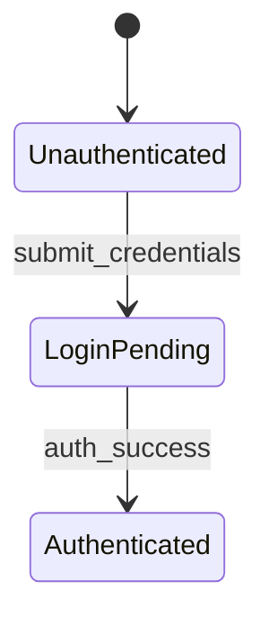

# Architecture Diagrams

Each architecture diagram consists of two files:
1. A **Mermaid** file (`.mmd`) containing the diagram definition.
2. An optional **Context** file (`context.json`) containing rich metadata for each node.

## File References in .uigraph.yaml

```yaml
architectureDiagrams:
  - name: Login Flow
    path: .uigraph/diagrams/login-flow/login-flow.mmd
    contextPath: .uigraph/diagrams/login-flow/context.json
```

## Mermaid File

Standard Mermaid syntax. Supported diagram types:
- `stateDiagram-v2`
- `flowchart`
- `sequenceDiagram`

### Critical Rule: Node Name Matching

Node names in the Mermaid file must exactly match the keys in `context.json` `nodes` object.

Example:


The keys `Unauthenticated`, `LoginPending`, `Authenticated` must exist as keys in `context.json` `nodes`.

## Context File Schema

```json
{
  "name": "string",
  "description": "string",
  "nodes": {
    "<node-key>": {
      "name": "string",
      "type": "string",
      "cloud": "string",
      "service": "string",
      "dbConfig": {
        "service": "string",
        "database": "string",
        "tableName": "string"
      },
      "data": {
        "<field-key>": {
          "type": "string",
          "value": "any"
        }
      },
      "style": {
        "fill": "string",
        "stroke": "string",
        "strokeWidth": "number",
        "borderRadius": "number",
        "strokeStyle": "string",
        "borderAnimationEnabled": "boolean",
        "backgroundColor": "string"
      }
    }
  }
}
```

### Node Types

- `cloud` — represents a cloud service (AWS, GCP, Azure)
- `data-source` — represents a database or external data source
- `text` — plain text node
- (other types may be supported by the gateway)

### Data Field Types

Each key under `data` is a field definition:

```json
{
  "type": "<ui-field-type>",
  "value": "<value-matching-type>"
}
```

Known UI field types:

| Type | Value Shape | Example |
|------|-------------|---------|
| `Text Input` | string | `"LoginPending"` |
| `Number Input` | number | `300` |
| `Boolean Toggle` | boolean | `true` |
| `Dropdown` | string | `"user"` |
| `Multi Select` | string array | `["read", "write"]` |
| `Date Picker` | string (ISO date) | `"2025-12-31"` |
| `Code Editor` | string (code) | `"def get_config(): ..."` |
| `Rich Text Editor` | string (markdown) | `"## Title\n\nBody"` |
| `Key-Value List` | array of objects | `[]` |
| `Tag Input` | string array | `["auth", "login"]` |
| `Date Range Picker` | null or object | `null` |
| `Color Picker` | string (hex) | `"#1976D2"` |
| `Slider` | number | `3` |
| `Search Select` | string | `"local"` |
| `Checkbox Group` | object with `value` and `options` | `{"value": ["read"], "options": ["read", "write"]}` |
| `URL Input` | string (url) | `"https://example.com"` |

### Cloud Configuration

When `type` is `cloud`:

```json
{
  "type": "cloud",
  "cloud": "AWS",
  "service": "Amazon Athena"
}
```

### Data-Source Configuration

When `type` is `data-source`:

```json
{
  "type": "data-source",
  "dbConfig": {
    "service": "UIGraph Adapter",
    "database": "ecommerce",
    "tableName": "users"
  }
}
```

### Style Properties

```json
{
  "style": {
    "fill": "#088ae7",
    "stroke": "#0076D2",
    "strokeWidth": 2,
    "borderRadius": 2,
    "strokeStyle": "dotted",
    "borderAnimationEnabled": true,
    "backgroundColor": "#f0f0f0"
  }
}
```

All style properties are optional.
