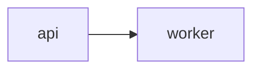

# Architecture Diagrams

Each architecture diagram consists of two files:

1. A **Mermaid** file (`.mmd`) containing the diagram definition.
2. An optional **Context** file (`context.json`) containing rich metadata for nodes, edges, and groups.

## File References in .uigraph.yaml

```yaml
architectureDiagrams:
  - name: Login Flow
    path: .uigraph/diagrams/login-flow/login-flow.mmd
    contextPath: .uigraph/diagrams/login-flow/context.json
```

## Mermaid File

Standard Mermaid syntax. Supported diagram types:

- `stateDiagram-v2`
- `flowchart`
- `sequenceDiagram`

Node IDs in the Mermaid file must match keys in `context.json` when context is provided.



```json
{
  "nodes": {
    "api": { "type": "cloud", "name": "API Gateway" },
    "worker": { "type": "component", "name": "Order Worker" }
  }
}
```

## Context Behavior

The converter uses context fields to change node types, add component fields, resolve icons, style existing nodes, and generate groups.

- `nodes[<node-id>]` applies only when `<node-id>` matches a Mermaid node ID.
- `name` creates or updates a hidden `Name` component field.
- `data` entries create or update component fields by label.
- `style.width` and `style.height` set node dimensions when present.
- Node style fields `fill`, `stroke`, `strokeWidth`, `strokeStyle`, `borderRadius`, and `borderAnimationEnabled` are copied into node data.
- Node `borderAnimationEnabled` also sets `strokeAnimation` to `dash`.
- `edges["<source>-<target>"]` applies only when source and target match the converted Mermaid edge.
- `groups` creates group nodes from existing context node IDs.

## Node Behavior

- `cloud` sets the node type to `cloud`, forces `150x150`, and resolves an icon from `cloud` plus exact `service` name when possible.
- `text` uses `value` to create the `Text` component field.
- `code` uses `value` to create the `Code` component field.
- `table` uses `table.columns`, `table.rows`, and `name` for rendered table content.
- `data-source` and `db-table` both convert to the database table node type and use `dbConfig`.
- `databaseTableSQL` is the round-trip database table node type.
- `component` converts to a `builder` node and sets `componentId`.
- `builder` can preserve full component field metadata during round-trip.
- `shape` sets `data.shape`; `or` and `summing-junction` are forced square with a minimum size of `200`.
- `image` uses `src` as the image source.
- `gif` uses `animatedIcon` for known animated assets or `src` for direct GIF URLs.
- `comment` is useful for review notes and unresolved diagram annotations.
- `sequenceParticipant` represents sequence-style participants with participant metadata.
- `groups` supports only `name` and `nodes`; group bounds are calculated from referenced nodes.

## Node Context Examples

Before generating context for a node type, review the matching skill-owned example file.

| Node or context type | Example file |
|----------------------|--------------|
| `cloud` | `assets/templates/diagram-context/cloud-nodes.context.json` |
| `text` | `assets/templates/diagram-context/text-nodes.context.json` |
| `code` | `assets/templates/diagram-context/code-nodes.context.json` |
| `table` | `assets/templates/diagram-context/table-nodes.context.json` |
| `data-source`, `db-table`, `databaseTableSQL` | `assets/templates/diagram-context/database-nodes.context.json` |
| `component`, `builder` | `assets/templates/diagram-context/component-builder-nodes.context.json` |
| `shape` | `assets/templates/diagram-context/shape-nodes.context.json` |
| `image` | `assets/templates/diagram-context/image-nodes.context.json` |
| `gif` | `assets/templates/diagram-context/gif-nodes.context.json` |
| `comment` | `assets/templates/diagram-context/comment-nodes.context.json` |
| `sequenceParticipant` | `assets/templates/diagram-context/sequence-participant-nodes.context.json` |
| `groups` | `assets/templates/diagram-context/group-context.context.json` |
| `data` field types | `assets/templates/diagram-context/component-field-types.context.json` |

## Shape Values

- `rectangle`
- `rounded-rect`
- `ellipse`
- `diamond`
- `triangle`
- `parallelogram`
- `trapezoid`
- `hexagon`
- `document`
- `cylinder`
- `delay`
- `off-page-connector`
- `display`
- `collate`
- `sort`
- `terminator`
- `or`
- `database`
- `multiple-documents`
- `subroutine`
- `manual-input`
- `summing-junction`
- `internal-storage`

## Animated Icon Names

- `Authentication`
- `Data Analysis`
- `Document`
- `Laptop`
- `Loading`
- `Message`
- `Mobile Analytics`
- `Notification`
- `Security`
- `Send Message`
- `Server`
- `Settings`
- `Stats`
